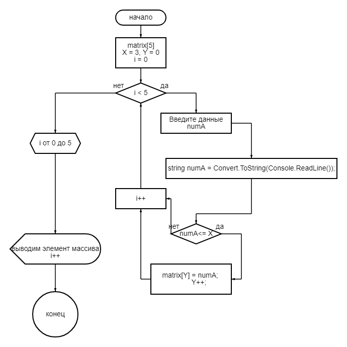

# Описание and ТЗ

# Блок схема

# Решение
1. Объявляется массив;
2. Создается массив объявленного размера;
3. Вводится значение пользователем;
4. Проверяется уловие, если элементов больше 3-х, то в массив такой элемент не заносится;
5. Выводим через цикл массив;
# *Конец*